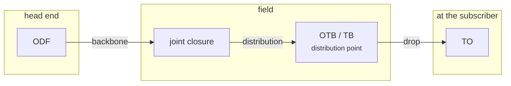

# Architecture

How the signal gets from the head end to the subscriber, and what each stretch is called.

## The full chain

## The three cable classes

In FiberQ's menu these three sit side by side, twice — once under **Underground** and once
under **Aerial**. That is why Georgian renders all three in the same grammatical form, as
adjectives, so the list reads evenly.

| # | English | Georgian | Meaning |
|---|---|---|---|
| 1 | `Backbone` | **მაგისტრალური** | Transport cable between the main network nodes |
| 2 | `Distribution` | **გამანაწილებელი** | From a backbone node out to the street distribution points |
| 3 | `Drop` | **აბონენტური** | From a distribution point to one subscriber's building |

!!! warning "`Drop` is a noun"
    `Drop` here is a **noun** — the drop cable, the subscriber cable. **Not** the verb.
    The catalogue flags this separately, because machine translation reads it as a verb
    almost every time.

    The Georgian noun for the concept is `მაგისტრალი`; the menu uses the adjective
    `მაგისტრალური` so all three classes line up in one series.

## The two installation methods

| English | Georgian | Meaning |
|---|---|---|
| `Underground` | **მიწისქვეშა** | In a duct or a trench, below ground |
| `Aerial` | **საჰაერო** | Strung overhead on poles |

`საჰაერო ხაზი` ("overhead line") is the established Georgian collocation, which is why
that adjective was chosen.

## What happens along the route

A cable seldom runs uninterrupted from A to B. Along the way:

- **Joint closures** — fibres are spliced, or some are branched off
- **Slack** — coiled spare cable for future splicing
  ([in detail](slack.md))
- **Latent elements** — passive elements recorded along the cable
- **Branches** (`Branch`) — points where cables meet or split

!!! info "`Branch` is not a company branch or a git branch"
    FiberQ's `Branch info` button shows how many cables, of which types and capacities,
    meet at the point you click. French: `dérivation`.

## What FiberQ does with all this

The plugin builds this structure **on the map**: the route is a line, elements are points,
buildings are polygons, and each has its own layer and attributes.

[:octicons-arrow-right-24: Data model](../fiberq/data-model.md)
