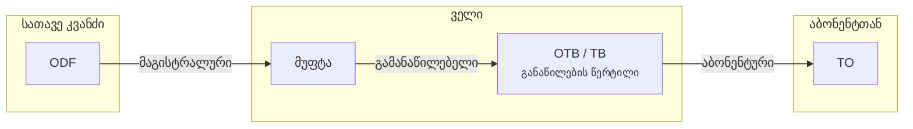

# არქიტექტურა

როგორ მიდის სიგნალი სათავე კვანძიდან აბონენტამდე და რა ჰქვია თითოეულ მონაკვეთს.

## სრული ჯაჭვი

## სამი კაბელის კლასი

FiberQ-ის მენიუში ეს სამი ერთმანეთის გვერდით დგას, ორჯერ — **მიწისქვეშა**-ს ქვეშ და
**საჰაერო**-ს ქვეშ. ამიტომ ქართულში სამივე ერთი ფორმისაა (ზედსართავი), რომ სია
თანაბრად იკითხებოდეს.

| # | English | ქართული | განმარტება |
|---|---|---|---|
| 1 | `Backbone` | **მაგისტრალური** | სატრანსპორტო კაბელი ქსელის მთავარ კვანძებს შორის |
| 2 | `Distribution` | **გამანაწილებელი** | მაგისტრალის კვანძიდან ქუჩის განაწილების წერტილებამდე |
| 3 | `Drop` | **აბონენტური** | განაწილების წერტილიდან ერთი აბონენტის შენობამდე |

!!! warning "`Drop` არსებითი სახელია"
    `Drop` აქ **არსებითი სახელია** — drop cable / აბონენტური კაბელი. **არა** ზმნა
    „ჩამოგდება". ეს ცალკე გვაქვს გაფრთხილებული კატალოგში, რადგან ავტომატური თარგმანი
    სწორედ ზმნად კითხულობს.

    ცნების არსებითი სახელია `მაგისტრალი`; მენიუში ზედსართავი `მაგისტრალური` დგას, რომ
    სამივე კლასი ერთ რიგში ჩაჯდეს.

## ორი გაყვანის წესი

| English | ქართული | რას ნიშნავს |
|---|---|---|
| `Underground` | **მიწისქვეშა** | მილში ან თხრილში, მიწის ქვეშ |
| `Aerial` | **საჰაერო** | ბოძებზე გადებული |

`საჰაერო ხაზი` ქართულში დამკვიდრებული შესიტყვებაა — ამიტომ არჩეულია.

## რა ხდება ტრასაზე

კაბელი A წერტილიდან B-მდე უწყვეტად იშვიათად მიდის. გზაზე:

- **მუფტა** — ბოჭკოები ერწყმის, ან ნაწილი განშტოვდება
- **მარაგი** — ხვეული ჭარბი კაბელი მომავალი შედუღებისთვის
  ([დეტალურად](slack.md))
- **შუალედური ელემენტი** — ტრასაზე ჩაწერილი პასიური ელემენტი
- **განშტოება** (`Branch`) — წერტილი, სადაც კაბელები იყრება/იყოფა

!!! info "`Branch` ≠ ფილიალი და ≠ git branch"
    FiberQ-ის `Branch info` ღილაკი აჩვენებს, რამდენი კაბელი, რა ტიპისა და რა ტევადობის
    იყრის თავს დაწკაპუნებულ წერტილში. ფრანგულად `dérivation`.

## რას აკეთებს ამ ყველაფერთან FiberQ

პლაგინი ამ სტრუქტურას **რუკაზე** აწყობს: ტრასა ხაზია, ელემენტები წერტილებია, შენობები
პოლიგონებია, და თითოეულს თავისი შრე და ატრიბუტები აქვს.

[:octicons-arrow-right-24: მონაცემთა მოდელი](../fiberq/data-model.md)
