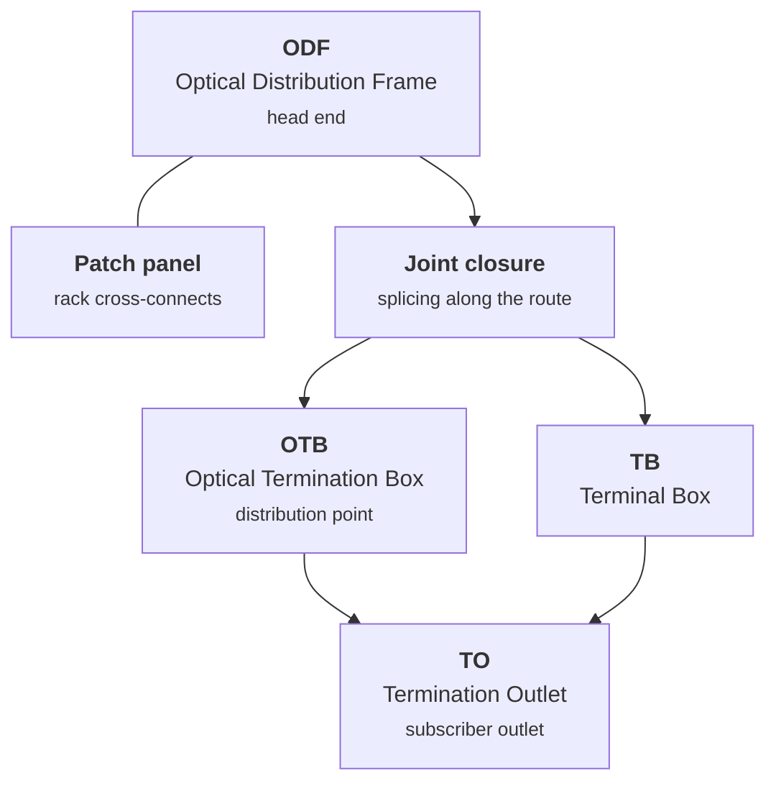

# Elements

In FiberQ an **element** means a passive optical device — ODF, OTB, TB, TO, patch panel,
joint closure. It is not an "object" in the GIS sense.

!!! abstract "Acronyms stay in Latin script"
    `ODF`, `OTB`, `TO` and `TB` stay in Latin script in the Georgian translation too, for
    two reasons: that is how the field writes them, and `ODF` doubles as a layer name in
    the code. Only the qualifying word is translated — `Indoor OTB` → `შიდა OTB`.

---

## The chain from head end to subscriber

---

## ODF — Optical Distribution Frame

**The passive frame at the head end where feeder fibres terminate.**

The network's starting point, where the operator's active equipment meets the fibre plant.

- **Georgian:** `ODF` (acronym kept)
- **In FiberQ:** `Place ODF` → `ODF-ის განთავსება`; a layer of the same name exists
- **Source:** `<extracomment>` — *"the passive frame at the head end where feeder fibres terminate"*

## Patch panel

**The rack panel holding patch connections.**

Its scope partly overlaps ODF, which the maintainer notes explicitly. The two must stay
clearly distinct in Georgian.

- **Georgian:** `პაჩ-პანელი`
- **Rejected:** `კომუტაციური პანელი` — more formal, less recognised in the field
- **Source:** `<extracomment>` — *"the rack panel holding patch connections. Its scope overlaps ODF"*

## OTB — Optical Termination Box

The distribution point from which drop cables run out. Three variants by mounting location:

| English | Georgian | Where it sits |
|---|---|---|
| `Indoor OTB` | `შიდა OTB` | Inside a building |
| `Outdoor OTB` | `გარე OTB` | Outside, on a wall or façade |
| `Pole OTB` | `ბოძის OTB` | **On a pole** |

!!! tip "`Pole OTB` is one element"
    It does not mean "a pole and an OTB" — it is a single element, an OTB mounted on a
    pole. Serbian catalogue: `OD ormar na stubu`.

## TB — Terminal Box

The Serbian backend name is `ZOK` (Zavrsna opticka kutija).

- **Georgian:** `TB` (acronym kept — Georgian has no established equivalent)

## TO — Termination Outlet

**The subscriber-side optical outlet — the last element before the customer's equipment.**

!!! danger "`TO` is an acronym, not the English preposition"
    The maintainer flags this trap separately. `Place TO` means "place a **TO**", not
    "place something **to** somewhere". Both machine translation and human translators
    misread this string.

Four variants:

| English | Georgian | Where it sits |
|---|---|---|
| `Indoor TO` | `შიდა TO` | Inside a building |
| `Outdoor TO` | `გარე TO` | Outside |
| `Pole TO` | `ბოძის TO` | On a pole |
| `Joint Closure TO` | `TO მუფტაში` | **Inside a joint closure** |

`Joint Closure TO` is a TO housed inside a joint closure — one element, not two.
Serbian: `TO Izvod u nastavku`.

## Joint closure

**The splice enclosure out on the route.**

- **Georgian:** `ოპტიკური მუფტა`, short form `მუფტა`
- **Other languages:** fr `BPE`, sr `nastavak`
- **In FiberQ:** `Place Joint Closure` → `მუფტის განთავსება`

`მუფტა` is universally used in Georgian cable practice, which is why it was chosen over
any descriptive alternative.

## Latent element

**A passive element sitting on a cable's path at a recorded distance along it — stored as
data, not drawn as a separate map feature.**

This term looked opaque to me at first and I asked the maintainer about it — but the
answer was already in the catalogue:

> In FiberQ a latent element is a passive optical element (joint closure, ODF, OTB,
> termination box) that sits ON a cable's path at a recorded distance along it, between
> the cable's two endpoints — recorded as data, not drawn as a separate map feature.
> "latent" = intermediate/pass-through, NOT "faulty", "hidden bug" or "dormant".

- **Georgian:** `შუალედური ელემენტი`
- **"Latent" is not** faulty, hidden or dormant — it means **intermediate / pass-through**

---

## What this page taught me

The `<extracomment>` notes are not supplementary information — **they are a primary
source**. Twice the "logical" translation from the English alone would have been entirely
wrong (`Object`, `TO`), and once I asked a question whose answer was already written down
(`latent elements`). **Notes first, then translate.**
