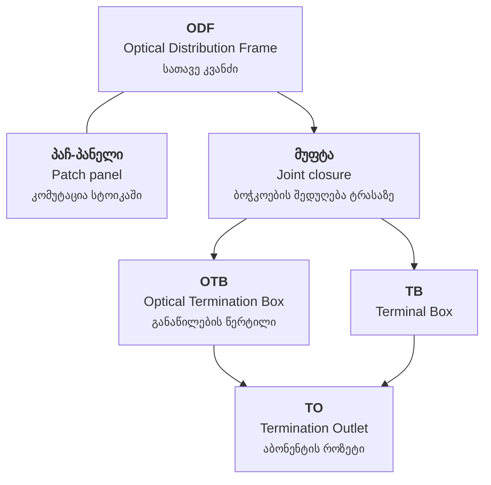

# ელემენტები

FiberQ-ში **ელემენტი** ნიშნავს პასიურ ოპტიკურ მოწყობილობას — ODF, OTB, TB, TO, პაჩ-პანელი,
მუფტა. ეს არ არის „ობიექტი" GIS-ის გაგებით.

!!! abstract "აკრონიმები ლათინურად რჩება"
    `ODF`, `OTB`, `TO`, `TB` ქართულ თარგმანშიც ლათინურად იწერება. ორი მიზეზი: დარგში
    სწორედ ასე იყენებენ, და `ODF` ამავე დროს შრის სახელიცაა კოდში. ითარგმნება მხოლოდ
    განმარტებითი ნაწილი — `Indoor OTB` → `შიდა OTB`.

---

## ჯაჭვი სათავიდან აბონენტამდე

---

## ODF — Optical Distribution Frame

**პასიური სტოიკა სათავე კვანძში, სადაც მაგისტრალური ბოჭკოები სრულდება.**

ქსელის საწყისი წერტილია. აქ ერთდება ოპერატორის აქტიური აღჭურვილობა და ბოჭკოს ქსელი.

- **ქართულად:** `ODF` (აკრონიმი რჩება)
- **FiberQ-ში:** `Place ODF` → `ODF-ის განთავსება`; ამავე სახელის შრეც არსებობს
- **წყარო:** `<extracomment>` — *"the passive frame at the head end where feeder fibres terminate"*

## პაჩ-პანელი — Patch panel

**სტოიკის პანელი, რომელზეც კომუტაციური (patch) შეერთებებია.**

მისი ფუნქცია ODF-ს ნაწილობრივ ემთხვევა — მეინთეინერიც ამას აღნიშნავს. ქართულში ორივე
მკაფიოდ განსხვავებული უნდა დარჩეს.

- **ქართულად:** `პაჩ-პანელი`
- **უარყოფილი ვარიანტი:** `კომუტაციური პანელი` — უფრო ფორმალურია, მაგრამ ველზე ნაკლებად
  ცნობადი
- **წყარო:** `<extracomment>` — *"the rack panel holding patch connections. Its scope overlaps ODF"*

## OTB — Optical Termination Box

**ოპტიკური დაბოლოების ყუთი.** განაწილების წერტილი, საიდანაც აბონენტური კაბელები გადის.

სამ ვარიანტში მოდის, დამონტაჟების ადგილის მიხედვით:

| ინგლისური | ქართული | სად დგას |
|---|---|---|
| `Indoor OTB` | `შიდა OTB` | შენობის შიგნით |
| `Outdoor OTB` | `გარე OTB` | გარეთ, კედელზე ან ფასადზე |
| `Pole OTB` | `ბოძის OTB` | **ბოძზე** |

!!! tip "„ბოძის OTB" ერთი ელემენტია"
    `Pole OTB` არ ნიშნავს „ბოძი + OTB" — ეს ერთი ელემენტია, ბოძზე დამონტაჟებული OTB.
    სერბულ კატალოგში: `OD ormar na stubu`.

## TB — Terminal Box

**დაბოლოების ყუთი.** სერბული backend-ის სახელი `ZOK` (Zavrsna opticka kutija).

- **ქართულად:** `TB` (აკრონიმი რჩება — ქართულს დამკვიდრებული ეკვივალენტი არ აქვს)

## TO — Termination Outlet

**აბონენტის მხარეს არსებული ოპტიკური როზეტი — ბოლო ელემენტი მომხმარებლის აღჭურვილობამდე.**

!!! danger "`TO` აკრონიმია, არა ინგლისური წინდებული"
    ეს ხაფანგი მეინთეინერს ცალკე აქვს გაფრთხილებული. `Place TO` არის „**TO**-ს განთავსება",
    და არა „განთავსება ... **სად**". სტრიქონი `Place TO` შეიძლება შეცდომით წაიკითხოს
    ავტომატურმა თარგმანმაც და ადამიანმაც.

ოთხ ვარიანტში მოდის:

| ინგლისური | ქართული | სად დგას |
|---|---|---|
| `Indoor TO` | `შიდა TO` | შენობის შიგნით |
| `Outdoor TO` | `გარე TO` | გარეთ |
| `Pole TO` | `ბოძის TO` | ბოძზე |
| `Joint Closure TO` | `TO მუფტაში` | **მუფტის შიგნით** |

`Joint Closure TO` — TO, რომელიც მუფტის შიგნით არის მოთავსებული. ერთი ელემენტია, არა ორი.
სერბულად: `TO Izvod u nastavku`.

## მუფტა — Joint closure

**ბოჭკოების შედუღების ყუთი ტრასაზე.**

- **ქართულად:** `ოპტიკური მუფტა`, მოკლედ `მუფტა`
- **სხვა ენებზე:** fr `BPE`, sr `nastavak`
- **FiberQ-ში:** `Place Joint Closure` → `მუფტის განთავსება`

`მუფტა` ქართულ საკაბელო პრაქტიკაში საყოველთაოდ გამოიყენება — ამიტომ არჩეულია აღწერითი
ვარიანტების ნაცვლად.

## შუალედური ელემენტი — latent element

**პასიური ელემენტი, რომელიც კაბელის ტრასაზე ზის, ჩაწერილი მანძილით — მონაცემად, და არა
ცალკე დახაზული ობიექტად.**

ეს ტერმინი თავიდან გაუგებარი მეჩვენა და მეინთეინერს კითხვაც დავუსვი — მაგრამ პასუხი უკვე
კატალოგში ეწერა:

> In FiberQ a latent element is a passive optical element (joint closure, ODF, OTB,
> termination box) that sits ON a cable's path at a recorded distance along it, between
> the cable's two endpoints — recorded as data, not drawn as a separate map feature.
> "latent" = intermediate/pass-through, NOT "faulty", "hidden bug" or "dormant".

- **ქართულად:** `შუალედური ელემენტი`
- **„latent" ≠ გაუმართავი, დამალული ან მიძინებული** — ნიშნავს **შუალედურს/გამვლელს**

---

## გაკვეთილი, რომელიც ამ გვერდმა მასწავლა

`<extracomment>` შენიშვნები არ არის დამატებითი ინფორმაცია — **ისინი პირველადი წყაროა**.
ორჯერ მოხდა, რომ ინგლისურიდან „ლოგიკური" თარგმანი მთლიანად არასწორი აღმოჩნდებოდა
(`Object`, `TO`), და ერთხელ მე თვითონ დავსვი კითხვა, რომლის პასუხიც უკვე ეწერა
(`latent elements`). **ჯერ შენიშვნა, მერე თარგმანი.**
