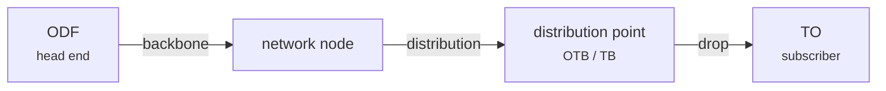

# The network

Before touching FiberQ's buttons, the network itself has to make sense: what it is made
of, and in what order. That is what this section is for.

!!! note "Sources"
    Much of what follows comes **straight out of the FiberQ catalogue** — the maintainer
    attached an `<extracomment>` note to 95 strings saying exactly what each term means
    *in this plugin*. Where that is the source, the page says so. Where it is general
    industry knowledge, it says that too.

## Three levels, one logic

An FTTH network divides into three levels, and FiberQ's three cable classes map onto them
exactly:

| Level | Cable class | What it does |
|---|---|---|
| 1 | **Backbone** | Carries traffic between the main network nodes |
| 2 | **Distribution** | From a backbone node out to the street distribution points |
| 3 | **Drop** | From a distribution point to one subscriber's premises |

These three appear in FiberQ's menu twice — once under **Underground**, once under
**Aerial**.

## Two ways to lay it: underground and aerial

The same three classes can be installed either way:

=== "Underground"

    Cable runs in a **duct** or a trench. **Manholes** sit along the route — underground
    inspection chambers giving access to the cable. Where the route crosses under a road,
    railway or watercourse, a large **transition pipe** is laid and the smaller ducts are
    pulled through it.

    [:octicons-arrow-right-24: Civil works](civil.md)

=== "Aerial"

    Cable is strung on **poles**. The run between two poles is a **span**. Some elements
    are mounted directly on the pole — `Pole OTB`, `Pole TO`.

## What sits on the line

A cable rarely runs from A to B uninterrupted and alone. Along the way there are:

- **Joint closures** — where fibres are spliced together
- **Slack** — spare cable coiled at a point so it can be re-spliced later
- **Elements** — ODF, OTB, TB, TO, patch panels

[:octicons-arrow-right-24: Elements](elements.md) ·
[:octicons-arrow-right-24: Cables](cables.md) ·
[:octicons-arrow-right-24: Optical slack](slack.md)

## Two things to keep straight in FiberQ

Two terms that translate wrongly if you go by the English alone:

!!! warning "`Object` means *building*"
    In FiberQ, `Object` renders the legacy Serbian `objekat` — a **building**. The layer
    it writes to confirms it: its fields are number of floors, basement levels, street and
    house number.

    Georgian QGIS meanwhile translates the GIS term *feature* as `ობიექტი` ("object").
    So: `Feature → ობიექტი`, `Object → შენობა`.

!!! warning "`Route` is a physical alignment"
    `Route` is the **path on the ground** that cables follow — not a travel route, and not
    a file or network path. Georgian has a dedicated engineering word for it: `ტრასა`.
