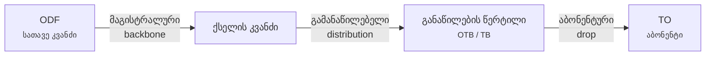

# ოპტიკური ქსელი

სანამ FiberQ-ის ღილაკებს შევეხები, თვითონ ქსელი უნდა გავიაზრო: რა რისგან შედგება და რა
რიგით. ეს განყოფილება სწორედ ამისთვისაა.

!!! note "წყაროები"
    აქ მოცემული განმარტებების დიდი ნაწილი **პირდაპირ FiberQ-ის კატალოგიდან** მოდის —
    მეინთეინერმა 95 სტრიქონს დაურთო `<extracomment>` შენიშვნა, სადაც ზუსტად წერია, რას
    ნიშნავს თითოეული ტერმინი *ამ პლაგინში*. სადაც ასეთი წყაროა, გვერდზე მითითებულია.
    სადაც საერთო დარგობრივი ცოდნაა — ისიც აღნიშნულია.

## სამი შრე, ერთი ლოგიკა

მთელი FTTH ქსელი სამ დონედ იშლება, და FiberQ-ის კაბელის სამი კლასიც ზუსტად ამას შეესაბამება:

| დონე | კაბელის კლასი | რას აკეთებს |
|---|---|---|
| 1 | **მაგისტრალური** (backbone) | ატარებს ტრაფიკს ქსელის მთავარ კვანძებს შორის |
| 2 | **გამანაწილებელი** (distribution) | მაგისტრალის კვანძიდან ქუჩის განაწილების წერტილებამდე |
| 3 | **აბონენტური** (drop) | განაწილების წერტილიდან ერთ კონკრეტულ აბონენტამდე |

ეს სამი სიტყვა FiberQ-ის მენიუშიც ზუსტად ასე დგას, ორჯერ — ერთხელ **მიწისქვეშა**
კაბელისთვის, ერთხელ **საჰაერო**-სთვის.

## ორი გზა: მიწისქვეშა და საჰაერო

ერთი და იგივე სამი კლასი ორნაირად შეიძლება გაიყვანოს:

=== "მიწისქვეშა"

    კაბელი მიდის **მილში** ან თხრილში. მარშრუტზე დგას **ჭები** — მიწისქვეშა სასინჯი
    კამერები, სადაც კაბელს წვდომა აქვს. გზის, რკინიგზის ან წყლის გადაკვეთაზე იდება
    მსხვილი **გადასასვლელის მილი**, რომელშიც წვრილი მილები გაივლება.

    [:octicons-arrow-right-24: ინფრასტრუქტურა](civil.md)

=== "საჰაერო"

    კაბელი ეკიდება **ბოძებზე**. ორ ბოძს შორის მონაკვეთს **მალი** ჰქვია. ელემენტების
    ნაწილი პირდაპირ ბოძზე მაგრდება — `ბოძის OTB`, `ბოძის TO`.

## რა არის ამ ხაზზე

გზაზე კაბელი არ არის უწყვეტი და მარტო. მასზე ზის:

- **მუფტები** — სადაც ბოჭკოები ერთმანეთს ერწყმის (შედუღება)
- **მარაგი** — ხვეულად შემოხვეული ჭარბი კაბელი, რომ მოგვიანებით თავიდან შედუღება
  შესაძლებელი იყოს
- **ელემენტები** — ODF, OTB, TB, TO, პაჩ-პანელი

[:octicons-arrow-right-24: ელემენტები](elements.md) ·
[:octicons-arrow-right-24: კაბელები](cables.md) ·
[:octicons-arrow-right-24: ოპტიკური მარაგი](slack.md)

## რაც FiberQ-ში ცალკე უნდა გვახსოვდეს

ორი ტერმინი, რომელიც ინგლისურიდან ბუნებრივად არასწორად ითარგმნება:

!!! warning "`Object` = შენობა, არა ობიექტი"
    FiberQ-ში `Object` ნიშნავს **შენობას** — ეს სერბული `objekat`-ის კვალია. ამას
    ადასტურებს შრე, რომელშიც იწერება: ველებია სართულების რაოდენობა, სარდაფის დონეები,
    ქუჩა და სახლის ნომერი.

    ამავე დროს QGIS-ის ქართული `feature`-ს თარგმნის როგორც **ობიექტს**. ანუ:
    `Feature → ობიექტი`, `Object → შენობა`.

!!! warning "`Route` = ტრასა, არა მარშრუტი"
    `Route` არის **ფიზიკური ტრასა მიწაზე**, რომელსაც კაბელი მიჰყვება — არა გადაადგილების
    მარშრუტი და არა ფაილის/ქსელის path.
