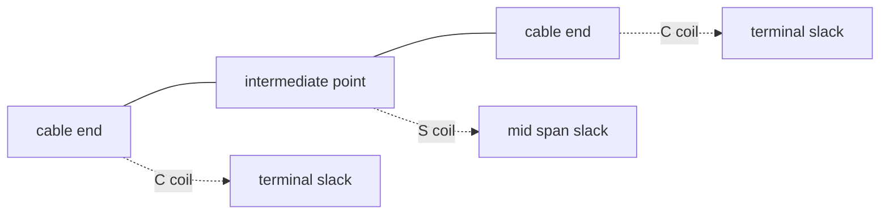

# Optical slack

**`Slack`** — the spare length of cable coiled and stored at a point so that it can be
re-spliced later.

- **Georgian:** `მარაგი` (matching the field's Russian `запас`, "reserve")
- **Full form:** `ოპტიკური მარაგი`

## Why it exists

If a cable is pulled to exactly the length needed, any future intervention — a new joint
closure, repairing damage, adding an element — means cutting the cable and re-pulling it.
Slack solves that: a coil left in advance lets a technician bring the cable down to the
manhole or the pole and work on it in place.

FiberQ's default when generating slack in batch: **20 m**.

---

## Two types that must not merge

The maintainer warns separately: **translating both with one word is not acceptable.**

=== "Terminal slack"

    **`Terminal slack`** — slack at a cable **end**.

    - Legacy name: `end slack`, internally `zavrsna`
    - Drawn as a **C coil**
    - Georgian: **`საბოლოო მარაგი`**
      *(expanded form: `საბოლოო წერტილის მარაგი`)*

=== "Mid span slack"

    **`Mid span slack`** — slack at an intermediate point where the cable runs **through**
    without being cut.

    - Legacy name: `thru slack`, internally `prolazna`
    - Drawn as an **S coil**
    - Georgian: **`შუალედური მარაგი`**

!!! tip "How to remember it"
    **Terminal** = the cable **ends** here. **Mid span** = the cable **passes through**.
    `span` is the run between two points — not a bridge span.

---

## The FiberQ tools

| String | Georgian | What it does |
|---|---|---|
| `Place terminal slack (interactive)` | საბოლოო მარაგის განთავსება (ინტერაქტიული) | You click the spot yourself |
| `Place mid span slack (interactive)` | შუალედური მარაგის განთავსება (ინტერაქტიული) | Same, for the mid-span type |
| `Generate terminal slacks at the ends of selected cables` | საბოლოო მარაგების გენერირება მონიშნული კაბელების ბოლოებზე | **Batch** — both ends of every selected cable at once |
| `Optical slacks` | ოპტიკური მარაგები | The tool group and the layer it writes to |
| `Terminal slack (shortcut)` | საბოლოო მარაგი (მალსახმობი) | A **hidden** action that exists only to bind the `R` key |

!!! note "\"(shortcut)\" is a key binding, not a file"
    `Terminal slack (shortcut)` does not appear on the toolbar — it shows up in the QGIS
    keyboard-shortcuts list. "Shortcut" here means the **key binding**, not a Windows
    shortcut file.

---

## Validation on slack

Two rules touch slack:

- `Optical slack references an existing cable` — a slack record must not be orphaned
- In the length checks: `total_len_m` must equal `duzina_m + slack_m`

So slack is stored in its own field and counts toward the cable's total length.

!!! warning "Recalculating lengths does not change slack"
    The `Recalculate lengths` dialog says so directly: *"Slack values are read but never
    changed."*
