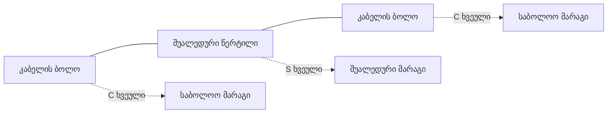

# ოპტიკური მარაგი

**`Slack`** — ხვეულად შემოხვეული ჭარბი კაბელი, რომელიც კონკრეტულ წერტილში ინახება, რომ
მოგვიანებით თავიდან შედუღება შესაძლებელი იყოს.

- **ქართულად:** `მარაგი` (ველზე რუსული `запас`-ის შესატყვისი)
- **სრული ფორმა:** `ოპტიკური მარაგი`

## რატომ არის საჭირო

თუ კაბელი ზუსტად საჭირო სიგრძეზეა გაჭიმული, ნებისმიერი მომავალი ჩარევა — ახალი მუფტა,
დაზიანების აღდგენა, ელემენტის დამატება — ნიშნავს კაბელის მოჭრას და ხელახლა გაყვანას.
მარაგი ამ პრობლემას წყვეტს: წინასწარ დატოვებული ჭარბი გრაგნილი საშუალებას აძლევს
ტექნიკოსს, კაბელი ჭასთან ან ბოძთან ჩამოიტანოს და ადგილზე იმუშაოს.

FiberQ-ის ნაგულისხმევი მარაგი ჯგუფური გენერაციისას — **20 მ**.

---

## ორი ტიპი, რომლებიც არ უნდა აირიოს

მეინთეინერი ცალკე გვაფრთხილებს: **ერთი სიტყვით ორივეს თარგმნა დაუშვებელია.**

=== "საბოლოო მარაგი"

    **`Terminal slack`** — მარაგი კაბელის **ბოლოში**.

    - ძველი სახელი: `end slack`, კოდში `zavrsna`
    - რუკაზე იხატება **C ხვეულად**
    - ქართულად: **`საბოლოო მარაგი`**
      *(გავრცობილი ფორმა: `საბოლოო წერტილის მარაგი`)*

=== "შუალედური მარაგი"

    **`Mid span slack`** — მარაგი შუალედურ წერტილში, სადაც კაბელი **გაივლის** მოჭრის
    გარეშე.

    - ძველი სახელი: `thru slack`, კოდში `prolazna`
    - რუკაზე იხატება **S ხვეულად**
    - ქართულად: **`შუალედური მარაგი`**

!!! tip "როგორ დავიმახსოვრო"
    **საბოლოო** = კაბელი აქ **მთავრდება**. **შუალედური** = კაბელი აქ **გადის**.
    `span` = მალი, მონაკვეთი ორ წერტილს შორის — და არა ხიდის მალი.

---

## FiberQ-ის ხელსაწყოები

| String | ქართული | რას აკეთებს |
|---|---|---|
| `Place terminal slack (interactive)` | საბოლოო მარაგის განთავსება (ინტერაქტიული) | თვითონ აწკაპუნებ ადგილს |
| `Place mid span slack (interactive)` | შუალედური მარაგის განთავსება (ინტერაქტიული) | იგივე, შუალედური ტიპისთვის |
| `Generate terminal slacks at the ends of selected cables` | საბოლოო მარაგების გენერირება მონიშნული კაბელების ბოლოებზე | **ჯგუფური** — ყველა მონიშნულ კაბელს ორივე ბოლოში ერთბაშად |
| `Optical slacks` | ოპტიკური მარაგები | ხელსაწყოთა ჯგუფი და შესაბამისი შრე |
| `Terminal slack (shortcut)` | საბოლოო მარაგი (მალსახმობი) | **დამალული** მოქმედება — მხოლოდ `R` კლავიშის მისაბმელად არსებობს |

!!! note "„(shortcut)" კლავიშია, არა ფაილი"
    `Terminal slack (shortcut)` არ ჩანს ხელსაწყოთა პანელზე — ის QGIS-ის კლავიატურის
    მალსახმობების სიაში ჩნდება. „shortcut" აქ **კლავიშის მიბმაა**, და არა Windows-ის
    მალსახმობი ფაილი.

---

## ვალიდაცია მარაგზე

ორი წესი ეხება მარაგს:

- `Optical slack references an existing cable` → **ოპტიკური მარაგი არსებულ კაბელს
  მიუთითებს** — მარაგი „ობლად" არ უნდა დარჩეს
- სიგრძეების შემოწმებისას: `total_len_m` უნდა უდრიდეს `duzina_m + slack_m`

ანუ მარაგი ცალკე ველშია ჩაწერილი და კაბელის სრულ სიგრძეში შედის.

!!! warning "სიგრძეების გადათვლა მარაგს არ ცვლის"
    `Recalculate lengths` დიალოგი პირდაპირ ამბობს: *"Slack values are read but never
    changed"* — მარაგის მნიშვნელობები იკითხება, მაგრამ არასდროს იცვლება.
